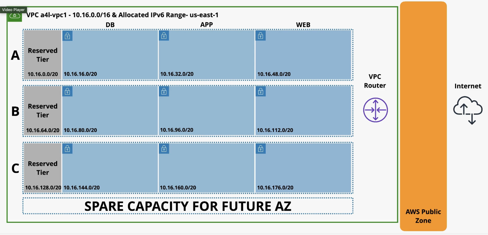

# How to on VCP subnet

The idea is to create a group of subnets within a VPC.

Cantrill has 3 sets of subnets, each in it's own AZ. Each set has 4 subnets: reserved, web, app, and db.



Steps:

Create the VPC with a CIDR block of 10.16.0.0/16

```bash
aws ec2 create-vpc --cidr-block 10.16.0.0/16
```

Create the subnets

[subnet list from Cantrill course](https://learn-cantrill-labs.s3.amazonaws.com/awscoursedemos/0059-aws-mixed-vpcsubnets/subnets.txt)

```bash
aws ec2 create-subnet --vpc-id vpc-12345678 --cidr-block 10.16.0.0/20 --availability-zone us-east-1a
aws ec2 create-subnet --vpc-id vpc-12345678 --cidr-block 10.16.16.0/20 --availability-zone us-east-1a
aws ec2 create-subnet --vpc-id vpc-12345678 --cidr-block 10.16.32.0/20 --availability-zone us-east-1a
aws ec2 create-subnet --vpc-id vpc-12345678 --cidr-block 10.16.48.0/20 --availability-zone us-east-1a
```

Then do the same for the other AZs.

```bash
aws ec2 create-subnet --vpc-id vpc-12345678 --cidr-block 10.16.64.0/20 --availability-zone us-east-1b
...
```

For fun, here is a list of numbers, counting by 16.
```
16, 32, 48, 64, 80, 96, 112, 128, 144, 160, 176, 192, 208, 224, 240, 255
10, 20, 30, 40, 50, 60, 70,  80,  90,  a0,  b0,  c0,  d0,  e0,  f0,  ff
```

```JavaScript
parseInt("10", 16)
parseInt("20", 16)
parseInt("ff", 16)
```

Then create the route table for the web subnet

You will need to add routes to open the subnet to the whole internet.

IPv4

0.0.0.0/0

IPv6

::/0


